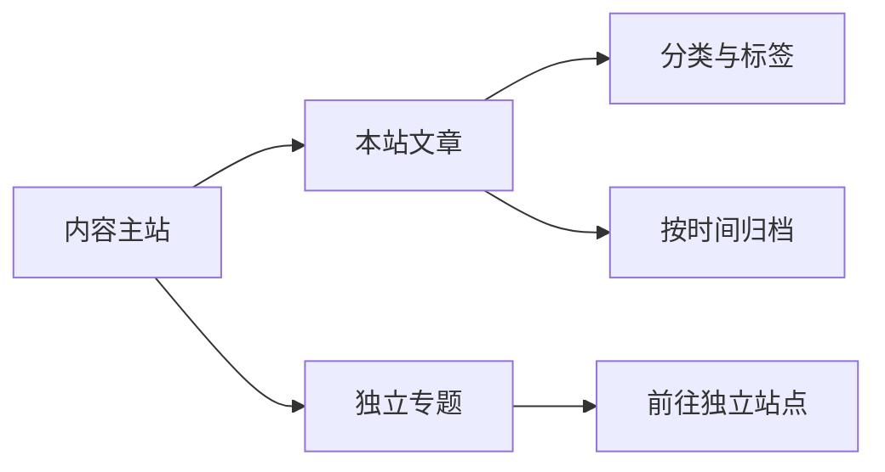

这是一份**站点使用说明**，也是正文排版的示例。这里会逐渐积累文章与随笔；长期连载和独立内容，则从「专题」前往各自的站点。

你可以直接开始阅读，也可以先打开右上角的「阅读设置」，把字号与页面主题调成舒服的样子。

## 从内容出发

首页把最近文章和专题放在一起。文章有一个主分类，也可以有多个标签：分类说明大致方向，标签把不同文章中的相同话题串起来。

归档按时间保存本站文章的入口。专题内容独立更新，主站不会复制它们的正文。例如《正在发生的世界史》，可以从[专题页](/topics/)进入它自己的阅读站。

> 不必一次读完。文字会留在这里，下次打开时，可以接着上次的位置继续。

## 把阅读调成喜欢的样子

「阅读设置」里可以切换浅色和深色两种主题，也可以调整正文字号。设置保存在当前浏览器；刷新页面或关掉标签页后，再次访问仍会尝试恢复。

文章顶部细线显示当前正文的阅读进度。重新打开读到一半的文章，会出现「继续阅读」入口。通过章节链接进入时，以链接指向的位置为准，不会被上次的进度打断。

| 功能 | 使用方式 | 保存范围 |
| --- | --- | --- |
| 页面主题 | 阅读设置 → 浅色 / 深色 | 当前浏览器 |
| 正文字号 | 阅读设置 → 字号滑块 | 当前浏览器 |
| 阅读位置 | 在文章中滚动，再次打开后继续阅读 | 每篇文章分别保存 |
| 离线阅读 | 联网打开文章，等待资源加载完成 | 浏览器保留的本地副本 |

浏览器限制存储、使用隐私模式或主动清理站点数据时，设置和离线副本可能丢失；这些情况不会妨碍正常的在线阅读。[^storage]

## 图表也属于正文

文字之外，文章可以用 Mermaid 表达流程。下面是一张示例图，用来说明本站文章与专题的关系。



图表下方可以展开源码。浅色和深色主题切换时，图表也会重新适配。内容相同，阅读环境由你选择。

## 写下一个公式

行内公式可以自然地放进句子：例如圆的面积是 $A = \pi r^2$。

需要独立表达时，可以使用块级公式。下面是一个只用于展示排版的有限求和式：

$$
\sum_{k=1}^{n} k = \frac{n(n+1)}{2}
$$

较长的公式在窄屏上可以横向滚动，正文不会因此被挤出屏幕。

## 代码与注释

代码块保留缩进，支持语法高亮和复制。下面只是一个简单的 TypeScript 示例：

```typescript
type ReadingPreferences = {
  theme: 'light' | 'dark';
  fontSize: number;
};

const preferences: ReadingPreferences = {
  theme: 'light',
  fontSize: 18,
};

console.log(preferences);
```

图片可以附带图注。下面是本站用于浏览器标签页与应用入口的图标：


需要补充说明的地方，可以像这样使用脚注。[^notes]

## 把网站留在桌面

页脚和阅读设置里都有「安装应用」。支持安装提示的浏览器会显示安装界面；其它浏览器会给出对应操作说明。也可以在浏览器菜单中寻找「安装应用」或「添加到主屏幕」。

安装后，站点以应用窗口打开，仍然使用相同的文章与导航。不同系统的安装方式和存储空间可能有区别，无需注册账号。

## 断网时，继续已读的文章

本站提供基础离线阅读：联网打开文章并完成缓存后，断网仍可以再次打开。没有缓存过的页面会显示明确的离线提示。

离线副本包括本站文章使用的本地样式、脚本、图表和公式资源。外部专题、视频及其它站点的内容由各自站点负责，不包含在主站的离线范围中。

网站发布新版本时，会尝试更新页面与资源。遇到需要更新应用的情况，会提示你选择更新时间，不会在阅读途中强制刷新。

这份说明会跟随实际功能维护。新的内容，接下来慢慢写。

[^storage]: 本站只使用当前设备的浏览器存储，没有账号、云端备份或跨设备同步。离线存储也可能被浏览器回收。
[^notes]: 脚注编号可跳到这里，注释后的返回链接可以回到正文引用处。
